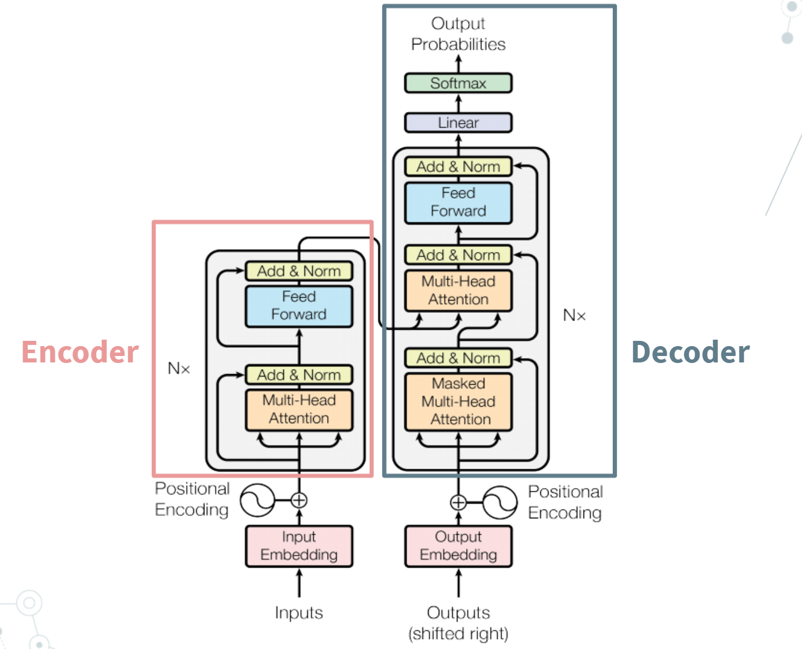
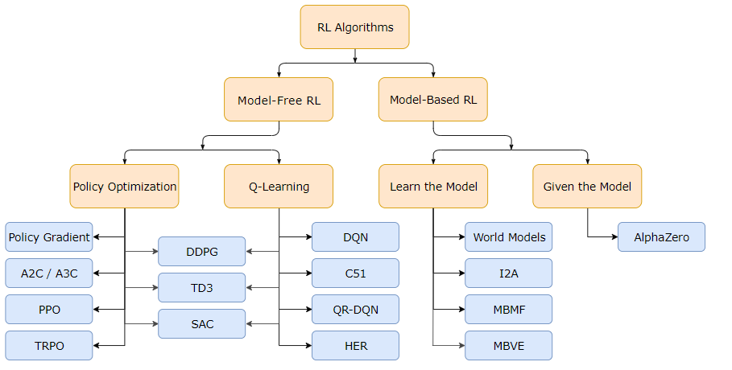
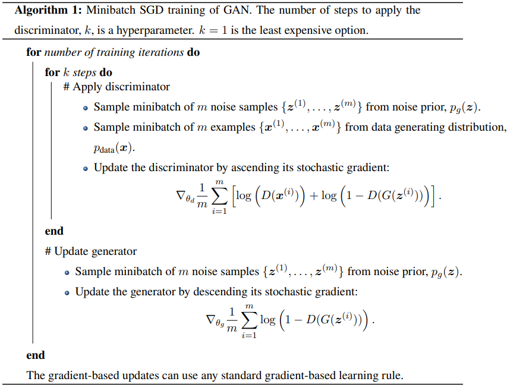

# Artificial Intelligence & Deep Learning Commonplace <!-- omit in toc -->

#### Table of Contents <!-- omit in toc -->

- [§1. Transformers](#1-transformers)
  - [§1.1 Vanilla Transformer Architecture](#11-vanilla-transformer-architecture)
    - [1.1.1 Input Embeddings and the Encoder Stack](#111-input-embeddings-and-the-encoder-stack)
    - [1.1.2 Why use Transformers over RNNs?](#112-why-use-transformers-over-rnns)
    - [1.1.3 Positional embeddings](#113-positional-embeddings)
    - [1.1.4 Self-attention](#114-self-attention)
    - [1.1.5 Multi-Head Attention](#115-multi-head-attention)
  - [§1.2 Bidirectional Encoder Representations from Transformers (BERT)](#12-bidirectional-encoder-representations-from-transformers-bert)
  - [Image + Attention](#image--attention)
- [§2. Deep Reinforcement Learning](#2-deep-reinforcement-learning)
  - [Getting Started](#getting-started)
    - [Review Paper:](#review-paper)
  - [On Policy Algorithms](#on-policy-algorithms)
    - [Vanilla Policy Gradient (VPG)](#vanilla-policy-gradient-vpg)
  - [Mine (Deep RL)](#mine-deep-rl)
- [§3. Generative Adversarial Networks](#3-generative-adversarial-networks)
    - [Vanilla GANs](#vanilla-gans)
- [Bioinformatics](#bioinformatics)
    - [Deep Learning for Genomic Prediction](#deep-learning-for-genomic-prediction)
    - [Computational Genomics (course, Rob Edwards)](#computational-genomics-course-rob-edwards)

---


<!-- ------------------------------------------------------------------ -->
<!-- ------------------------------------------------------------------ -->

---

# §1. Transformers

---

<!-- ------------------------------------------------------------------ -->
<!-- ------------------------------------------------------------------ -->

The Transformer is revolutionary and disruptive. It is one of the most influential breakthroughs in AI in the past decade as Transformers have pushed or approached the state-of-the-art (SOTA) in almost every area of deep learning, leaving recurrent neural networks (RNNs) and convolutional neural networks (ConvNets) behind. 

The Transformer architecture was introduced in "[Attention is All You Need][vaswani-2017-attention]".  This paper presented improvements to soft attention and made it possible to do sequence to sequence (seq2seq) modeling without the use of RNNs. The Transformer is entirely built on self-attention mechanisms (§1.1).

Papers to mine:
- Rethinking Attention with Performers. Choromanski et al. 2021. [[paper]](https://arxiv.org/pdf/2009.14794.pdf)
  - Tags: transformer, efficient transformer
  - Affiliations: Google Brain

---

## §1.1 Vanilla Transformer Architecture

The Vanilla Transformer was created by a research team at Google AI in "Attention if All You Need" ([Vaswani et al., 2017][vaswani-2017-attention]). The Vanilla Transformer was originally used for machine translation and consists of an encoder-decoder structure.

The Transformer encoder and decoder are actually stacks of layers. The encoder is a stack of encoder layers and the decoder is a stack of decoder layers. This diagram shows an example of one encoder layer and one decoder layer.



[vaswani-2017-attention]: https://proceedings.neurips.cc/paper/2017/file/3f5ee243547dee91fbd053c1c4a845aa-Paper.pdf

Encoder: Takes in a sequence, $\bm{x}$, and generates an a sequence of continuous representation vectors, $\bm{z}_{enc}$. These representations are then used as input for the decoder.

Decoder: Takes the sequence of representations, $\bm{z}_{enc}$, created by the encoder and generates a new output sequence, $\bm{y}$. 

Note that $\bm{x} = (x_1, \ldots, x_n)$ and $\bm{z} = (z_1, \ldots, z_n)$ must be equidimensional, whereas $\bm{y} = (y_1, \ldots, y_m)$ can have a different dimension. In the context of machine translation, this says that an input sentence represented by $\bm{x}$ with length $n$ may translate to an output sentence represented by $\bm{y}$ with length $m$ and $n$ doesn't necessarily equal $m$.  

### 1.1.1 Input Embeddings and the Encoder Stack

A single encoder layer is composed of two main blocks, the multi-head attention block and a feed-forward block. Before a sequence can be passed into encoder stack, it has to be embedded and given positional encodings/embeddings. Here, embedding a sequence means converting each element of the sequence into a vector representation. 


#### Sequence transduction models

What is transduction? 

> transduce: to convert (something, such as energy or a message) into another form. "Essentially, sense organs transduce physical energy into a nervous signal." - [Merriam-Webster Dictionary](https://www.merriam-webster.com/dictionary/transduce) (online).

Thus, it's safe to assume that sequence transduction models are loosely defined as models that convert a sequence into another form. Here are some examples of transduction models (mostly from NLP). 
- Transliteration: Generating words in a target form given examples in a source form.
- Spelling Correction: Predicting correct word spelling (sequence of letters) given incorrect word spelling (sequence of letters).
- Machine Translation: Generating sentences in a target language (sequences of words) given sentences in a source language.
- Speech Recognition: Predicting sequences of text given sequences of audio.
- Protein Secondary Structure Prediction: Generating 3D structure of protein given sequences of amino acids.
- Text-to-Speech, or speech synthesis: Generating audio given text sequences.
- Signal processing transduction: Generating electrical energy within a system given an audio signal (sound waves). This is done by a transducer. 

Transduction is closely related to the concepts of deductive and inductive reasoning. **Deductive reasoning** is taking a general theory to make a claim about specific observations, whereas inductive reasoning is taking specific observations to form a general theory. 

Ex. When my niece, Kambri, was 4 years old, she noticed that most adults she came across existed in mom-dad pairs. She'd met my girlfriend at the time and, when eating the French toast sticks and eggs we made her for breakfast, she asked, "Uncle 'Nique, are you a daddy too?" Her thought process: Uncle Unique is an adult, male, and has a female companion. Therefore, he's  probably a daddy. This is an example of deductive reasoning because my niece was confirming her theory about moms and dads with a specific observation (me).  

In machine learning, logic, and statistical inference, **transduction is the combination of induction and deduction to go from specific training observations to specific test observations**. Consider machine translation. English sentence → model → Spanish sentence. Here, the model acts as the "general theory". 

#### Handling sequences of varied length

You wonder how sequences of different length are handled as inputs to the Transformer. Sometimes, people go as far as saying that "Transformers can handle inputs of arbitrary length", which is false, or at least, incomplete. What people mean to say is that **Transformers can handle inputs of arbitrary length up to some maximum length threshold**. But how? 


> "Attention mechanisms have become an integral part of compelling sequence modeling, allowing modeling of dependencies without regard to their distance in the input or output sequences." - Vaswani et al., 2017
- [ ] Q: How can dependencies in the sequence ignore distance?

Just as in other sequence transduction models, the Transformer uses learned embeddings. These learned embeddings convert input tokens and output tokens into vectors of dimension $d_{\text{model}}$. 


#### Input embeddings


---

### 1.1.2 Why use Transformers over RNNs?

- [ ] Q: If the vanilla Transformer is an encoder-decoder architecture why use it instead of the RNN based encoder-decoder?  

RNN models have several problems. They are slow to train and cannot deal with long sequences. An RNN encoder-decoder
- [ ] Q: Why are RNNs slow?
- [ ] Q: Why can't RNNs deal with long sequences?

RNNs need data to be processed sequentially. A more precise way of saying this is, the elements of a given input vector must be processed in sequential order rather than in parallel. That's a big problem. This recurrent process doesn't make efficient use of modern GPUs and TPUs, which are designed for parallel computation.

> "RNNs are so slow that truncated backpropagation was introduced to limit the number of timesteps in the backward pass, estimating gradients to update the weights rather an doing backpropagation fully." - Jingles (Hong Jing)

Long-term dependency problems in RNNs

One reason that RNNs can't handle long sequences is that the have vanishing or exploding gradients if the input sequence gets too long. This can result in NaNs (Not a Number) popping up in the losses in the training process. Long Short-Term Memory (LSTM) networks were introduced in 1997 (Hochreiter and Schmidhuber) to address these problems. LSTMs have improved memory and can handle longer sequences than traditional RNNs, however they are even slower to train. 

In RNNs, each hidden state $h_i$ has dependencies on the previous hidden state $h_{i-1}$. Consequently, the embeddings made by the encoder must be computed one at a time. Transformers have no concept of a time step. **An entire input sequence is passed into a Transformer encoder in parallel**, and the "time step" information is integrated via position embeddings.  

Transformer Encoder


```python
# Ex. Transformer Encoder (conceptual pseudo code)
sentence = get_input_sentence() # Input an English sentence.
for word_idx, word in enumerate(sentence): 
    # This part is written as a loop for clarity, but it's typically in parallel
    semantic_vec = compute_embedding(word)
    position_embedding = encode_position(position = word_idx)
    word_representation = semantic_vec + position_embedding
```
1. Input an English sentence. 
2. Each word in the sentence is converted into an embedding to represent meaning/semantics called a context vector.
3. Add a position embedding to the context vector of each word in the sentence.


#### References
- Illustrated Guide to Transformer: A component by component breakdown analysis. [[article]](https://jinglescode.github.io/2020/05/27/illustrated-guide-transformer/)

---

### 1.1.3 Positional embeddings

positional embedding is synonymous with positional encoding 

Transformers proven to work well on any kind of data, especially when there is a large amount of data to train on with self-supervision.
Transformers do not process inputs sequentially but all at one time (in parallel). For each element of the input, information is combined from the other elements through self-attention. Each element does this aggregation on its own independently of what the other elements do. The transformer architecture does not model the order of the input anywhere. Thus, positional information in the input sequence must be explicitly encoded. 

Positional embeddings are identifiers or hints that tell the Transformer where an element of the input lies within the sequence. These positional embeddings are then added to the original vector representation of the input sequence. Positional embeddings are order, or position, vectors added to vectors for the Transformers to know the order of the sequence. 

Positional embeddings requirements:
1. Every position must have the same identifier regardless of the length of the input sequence length or what the input is. I.e., swapping out sequence should not change the positional embedding vector. 
2. The values of a positional embedding should not be too large, or they will push vectors into super distinct subspaces, where the positional similarity is too powerful for semantic similarity to take effect in the vector space. 

In "Attention is All You Need", the choice of positional embeddings was not obvious. We'll discuss simple examples. 
1. Let's say we have an input sequence $x$. Why not use integer encodings for each element of $x$, i.e. a linear function? These integer values are too large. People tend to aim for keeping the values in a positional embedding between 0 and 1.
2. What about a sigmoid? It's bounded between 0 and 1 and can handle values that are infinitely large. → We also want variability in the positional embeddings. The sigmoid doesn't differentiate values that are extremely positive or extremely negative because it's asymptotic at the ends. An example of a function that has some variability and still accepts all reals would be sine and cosine.   

What are some issues with sine and cosine? These functions are periodic, meaning that we'll see the same positional embedding at different values. What's a possible solution? Use such a low frequency for the trig functions such that, even for the longest sequence lengths, our function will not repeat. This solves some of the aforementioned problems, but it's still not optimal because:
- the positional embeddings must push far enough in the vector space to make reasonable clusters, but they also shouldn't push too far or their signal will outshine that of the semantic information. Distances between points in the representation space should not be dominated by either positional or semantic information. What's the solution here? → Herein lies using the alternating sine and cosines with increasing frequency. 
- (Video notes in progress)

Date: 21年8月1日

---

### 1.1.4 Self-attention


Self-attention is when a model makes predictions for each part of an input sample using other parts the same sample. A self-attention module returns the same number of outputs as inputs it receives. 

All Transformer-based architectures rely on self-attention. 

Broad categories of attention:
- **Self-attention** relates different positions of the same input sequence. Self-attention is also referred to as intra-attention.
- **Soft attention** is when a model attends to the entire input state space. Soft attention is a.k.a. global attention.
- **Hard attention** is when a model attends to part of the input state space, i.e. a patch of an input image or a chunk of an input sequence. Hard attention is a.k.a. local attention.

- [ ] Q: What makes it self-attention as opposed to just attention?

Each layer of a neural network has inputs, potential activations, and outputs. RNNs additionally have states of the layers. When an attention mechanism is used, a model takes input from the activations or states of some layer. If this layer that the inputs are taken from is the same layer that the attention mechanism is applied to, this process is called **self-attention** because a layer is attending to itself. 

Ex. Each word in a sequence attends to every other word in the same sequence. Self-attention captures the relationship between words in the sequence. 

Attention is often applied to transfer information from encoder to decoder, meaning that the decoder neurons receive input from the encoder states/outputs. This would not be self-attention because two different components (encoder and decoder) are connected. Self attention is applied within one component. 

Ex. In the BERT architecture, there is no decoder, only self-attention within the encoder.

Ex. Self-attention (**intra-attention**) models dependencies between different parts of a sequence. To use a previous example, we could try to get the semantic relationship between words in a sentence. Non-self-attention (**inter-attention**) models could look at dependencies between different sequences, such as those between a text and its translation to another language. Note however that self-attention is also extremely effective at translation tasks (hence Transformers).

Ex. Inter-attention can quantify dependencies between an image and its description. 

- [ ] How does self-attention work?


#### Alignment Score Functions

Each type of attention has an alignment score function. Some examples of alignment score functions are  content-base, additive, location-based, general, dot-product, and scaled dot-product.

Alignment score functions dictate how inputs are multiplied and added together to get the attention score. They do not dictate whether the mechanism is self-attention or inter-attention. 

- [ ] Q: 

Neural Machine Translation by Jointly Learning to Align and Translate. Badhanau, Cho, and Bengio. 2016. [[paper]][badhanau-2017-neural]

[badhanau-2017-neural]: https://arxiv.org/pdf/1409.0473.pdf

- [ ] Q: What is machine translation?
- [ ] Q: What makes neural machine translation neural?

#### Types of alignment score functions

- [ ] Q: Why use scaled dot-product attention instead of regular dot-product attention? A: Multiplying by a scaling factor of $\frac{1}{\sqrt{n}}$ helps deal with problem that, when the input is large, the softmax function may have an extremely small gradient, leading to inefficient learning. 

---

### 1.1.5 Multi-Head Attention

---


##### §1.1 References

Transformers 
- Attention is All You Need. Vaswani et al. 2017. [[paper]][vaswani-2017-attention]
- Devlin, J., Chang, M. W., Lee, K., & Toutanova, K. (2018). BERT: Pre-training of Deep Bidirectional Transformers for Language Understanding. arXiv preprint arXiv:1810.04805. [[paper]](https://arxiv.org/pdf/1810.04805.pdf)
- Adalogou, Nikolas. (2021). Transformers in Computer Vision. AI Summer. [[github-repo]](https://github.com/The-AI-Summer/self-attention-cv)

Input Embeddings
- Alammar, Jay. (2019). The Illustrated Word 2 Vec. [[blog]](https://jalammar.github.io/illustrated-word2vec/)
- Tsu. (2020). [[Artificial Intelligence Stack Exchange]](https://ai.stackexchange.com/questions/22957/how-can-transformers-handle-arbitrary-length-input)


Sequence Transduction Models
- Transduction (machine learning). [Wikipedia](https://en.wikipedia.org/wiki/Transduction_(machine_learning)).
- Gentle Introduction to Transduction in Machine Learning. Brownlee. 2017. [[article]](https://machinelearningmastery.com/transduction-in-machine-learning/)

Positional Embeddings
- Adalogou, Nikolas. (2021). How Positional Embeddings work in Self-Attention (code in PyTorch). AI Summer. [[blog]](https://theaisummer.com/positional-embeddings/)
- Parcalabescu, Letitia. (2021). Positional embeddings in transformers EXPLAINED | Demystifying positional encodings. AI Coffee Break with Letita. [[video]](https://youtu.be/1biZfFLPRSY)
- Parcalabescu, Letitia. (2021). Self Attention with Relative Position Representations – Paper explained. AI Coffee Break with Letita. [[video]](https://youtu.be/DwaBQbqh5aE)   


---

## §1.2 Bidirectional Encoder Representations from Transformers (BERT)


BERT: pre-Training of Deep Bidirectional Transformers for Language Understanding. Devlin et al. 2019.
- Tags: transfer learning, pre-training, Transformer, NLP, masked language model, bidirectional
- Affiliations: Google AI Language
- [[paper]](https://arxiv.org/pdf/1810.04805.pdf)


BERT does not include a Transformer decoder.


Alammar, Jay. (2020). The Illustrated BERT, ELMo, and co. (How NLP Cracked Transfer Learning) [[blog]](https://jalammar.github.io/illustrated-bert/)

---

## Image + Attention

---

#### Facebook AI Research applies Transformer architecture to streamline object detection models. 2020.

-   Tags:
-   Affiliations: Facebook AI
-   [[paper]](https://ai.facebook.com/research/publications/end-to-end-object-detection-with-transformers) [[article]](https://venturebeat.com/2020/05/28/facebook-ai-research-applies-transformer-architecture-to-streamline-object-detection-models/)

#### An Image is Worth 16x16 Words: Transformers for Image Recognition at Scale. Dosovitsky et al., 2021. 

-   Tags: Transformer, image recognition, CNNs, scale
-   Affiliations: Google AI
-   [[paper]](https://arxiv.org/abs/2010.11929) [[article]](https://ai.googleblog.com/2020/12/transformers-for-image-recognition-at.html) [[code]](https://paperswithcode.com/paper/an-image-is-worth-16x16-words-transformers-1)

A pure Transformer applied directly to sequences of image patches can perform well on image classification tasks. Vision Transformer (ViT) attains comparable results to state-of-the-art ConvNets while requiring substantially fewer computational resources to train. 

##### Preliminary questions
1. How does it require fewer computational resources?
2. What are these excellent results?
3. What was the architecture size?
4. How did the pre-training work?
5. What are the components of the architecture?
6. Why use those components in the architecture?

Transformers are self-attention based architectures. 

Transformers are considered to have been made by Vaswani et al. in 2017 in Attention is all you need.

The dominant approach for using Transformers in NLP has been to pre-train on a large text corpus and then fine-tune to a smaller task-specific dataset. This was the central theme of the initial BERT paper (BERT: Pre-training of deep bidirectional transformers for language understanding. Devlin et al. 2019.).

In large-scale image recognition, classic ResNet-like architectures are still state of the art  (below papers).
- Exploring the limits of weakly supervised pretraining. Mahajan et al. 2018.
- Self-training with noisy student improves ImageNet classification. Xie et al. 2020.
- Big Transfer (BiT). Kolesnikov et al. 2020.

A standard Transformer is applied directly to images by splitting an image into patches and then providing the sequence of linear embeddings of these patches as an input to the Transformer. Image patches are treated like tokens (words) in an NLP application. Image classification is then a standard supervised training procedure. 

In which ways are ConvNets better or worse than Transformers?
Transformers, when compared to ResNets of comparable size, are outperformed by a few percentage points in accuracy when trained on mid-sized datasets such as ImageNet without strong regularization. Why? Because Transformers lack certain biases inherent to ConvNets such as translational equivariance and locality. Consequently, Transformers don't generalize as well when trained on insufficient amounts of data. 

However, when trained on datasets of 14M-300M images, the large scale training outdoes inherent bias of ConvNets, approaching or beating the state-of-the-art on multiple image recognition benchmarks.

Common image recognition benchmarks:
- ImageNet
- ImageNet-ReaL
- CIFAR-100
- VTAB suite of 19 tasks

Vision Transformer (ViT) gets excellent results when pre-trained at sufficient scale and transferred to tasks with fewer data points. 

The related work section of the paper gives a thorough review of some of the recent breakthroughs in applications of attention to image-based tasks. 

Naive application of self-attention to an image would require that each pixel attends to every other pixel. -> quadratic cost in the number of pixels -> doesn't scale to realistic image sizes

- [ ] Q: What's the alternative?


The Transformer encoder consists of alternating layers of multiheaded self-attention and MLP blocks. 

- [ ] Q: Is there such thing as a single-headed attention?

Come back to this paper after deep-diving on Vaswani's paper. You've read maybe 5 pages so far. 


#### Attention Agent: Neuroevolution of Self-Interpretable Agents. Tang, Ngyuen, and Ha. 2020.

-   Tags: interpretability, evolutionary algorithm, Transformer, self-attention, deep RL, image input
-   Affiliations: Google Brain (Google AI), Google Japan

#### CURL: Contrastive Unsupervised Representations for Reinforcement Learning. Srinivas et al., 2020.

-   Tags: unsupervised, representation learning, deep RL, CNNs, image input
-   Affiliations

#### M-CURL: Masked Contrastive Representation Learning for Reinforcement Learning. Zhu et al., 2020.

- Tags: masked training, representation learning, sample efficiency, self-supervised, CNNs, transformer, deep RL, BERT, contrastive learning, image input
- Affiliations: 1. University of Science an Technology of China. 2. Microsoft Research

Improving sample efficiency is a key research problem in reinforcement learning (RL). Contrastive Unsupervised representations for Reinforcement Learning (CURL).

Q: Besides the involvement masked training, what’s the key difference between M-CURL and CURL?  
A: M-CURL deals with videos (seqs of images) rather than individual images. Although consecutive frames are highly correlated, CURL handles them independently. M-CURL’s main improvement, outside of getting improved performance on several benchmarks, is that it takes into consideration the correlation between sequential frames.

This is where the transformer comes in. The Transformer, together with a CNN encoder, leverages the correlation of consecutive input frames to reproduce missing features in masked frames.

Q: Why use Transformers, specifically?  
A: The input in this paper was a sequence of images rather than a single image. Transformers (Waswani et al., 2017) are the current state-of-the-art module for modeling sequences and capturing their interdependencies.

Q: The authors call the Transformer module an "auxiliary Transformer". What makes it auxiliary?

Q: CNN encoder of what? What’s being encoded? And what is meant by "encode" here?

Q: Why discard the Transformer during action selection?

Q: Policy network? What does it do? What is it made up of? What are its inputs?

Q: Contrastive learning?

<!-- ------------------------------------------------------------------ -->
<!-- ------------------------------------------------------------------ -->

---

# §2. Deep Reinforcement Learning

---

<!-- ------------------------------------------------------------------ -->
<!-- ------------------------------------------------------------------ -->


## Getting Started

From Lex Fridman’s intro lecture on deep reinforcement learning
[[video]](https://youtu.be/zR11FLZ-O9M?t=0).

Deep reinforcement learning (RL) is perhaps one of the most exciting fields in artificial intelligence (AI). It marries the beauty and power of deep neural networks to represent and comprehend the world with the ability to act on that understanding. That’s basically what the creation of intelligent beings is. Recent breakthroughs in RL captivate our imagination and inspire us.

RL at high level: An agent has to make a sequence of decisions.

##### Types of Learning:

4 learning domains within machine learning: Supervised, semi-supervised, unsupervised, and reinforcement. People often think that supervised learning is the only domain that requires manual labeling, however in reality, all types of machine learning are "supervised" in some way by a loss function. Every type of machine learning is supervised learning to a degree. These names for the domains tell us about the cost of human labor required to obtain that supervision.

-   Supervised learning: "teach by example"; RL: "teach by experience"

##### RL in humans: 

Humans appear to learn to walk (and do many other activities) through "very few examples" of trial and error. **How** is an open question.
Possible answers:

-   Hardware: 230 million years of bipedal movement data
-   Imitation learning: Observation of other humans walking
-   Algorithms: Better than backpropagation and stochastic gradient descent

Current spot: <https://youtu.be/zR11FLZ-O9M?t=757>

#### 3 Types of RL

There are countless ways to taxonomize all of the reinforcement learning algorithms. At the highest level, there are model-based algos and model-free algos. We generally put algorithms under 3 categories:
model-based, value-based, and policy-based.

##### Model-based: 
-   Learn a model of the world, then plan using the model. As an agent interacts with the environment, it constructs a model for what the dynamics of the world might be.
-   Better sample efficiency. Once you have a model, you can do all kinds of reasoning that doesn’t require experiencing each scenario.
-   In chess and in Go, the model is given to you. The agent knows the rules of the game.

What is meant by “model" is model-based learning?

In this context, a model of the environment would be a function which predicts state transitions and rewards.

AlphaZero is the reinforcement learning algorithm that learned to play Chess and Shogi.

AlphaZero is a famous example of a model-based algorithm.

[[AlphaZero paper, 2017]](https://arxiv.org/pdf/1712.01815.pdf)

Q: If model-based methods are more sample efficient when they work, what is the advantage of model-free methods?

Q-functions are also called action-value functions.

Q: And what’s the difference between action-value function and state-value function?  
A: The state-value function returns the value of achieving a certain state, whereas the action-value function returns the value for choosing an
action in a state.

Q: Why are Q-functions sometimes called action-value functions?  
A: Because the Q-function gives us the value for taking an action in some state.

Note that, as of 2018, model-free methods are more popular and have been
more extensively developed and tested than model-based methods.

##### Value-based: 

-   Learn the state or state-action value. Value-based methods look to estimate the quality of states and the possible actions performed in them. This quality of the state is then used to pick a “best” action.

-   Act by choosing the best action in a state. This is considered indirect learning of a “policy”.

##### Policy-based: 

- Learn the stochastic policy function that maps state to action.
- Directly learn a policy function. In other words, take as input the representation (or representation of that world) and output an action. This action will be stochastic.
- Act by sampling policy.
- Exploration is baked in. Why? The output action is stochastic, meaning it’s a r.v.

Great resource for learning about deep reinforcement learning: Open AI Spinning Up [[link]](https://spinningup.openai.com/en/latest/user/introduction.html)



### Review Paper: 

Deep learning is enabling reinforcement learning (RL) to scale to problems that were previously intractable, such as learning to play video games directly from pixels. Deep reinforcement learning algorithms are also applied to robotics, allowing control policies for robots to eb learned directly from camera inputs in the real world.

**Topics covered**: Value-based methods, policy-based methods, central algorithms in deep reinforcement learning such as the deep Q-network, trust region policy optimisation, and asnchronous advantage actor-critic. Conclude with several current areas of research within the field.

Primary goal of the field of artificial intelligence (AI) is to produce fully autonomous agents that interact with their environments to learn optimal behaviours, improving over time through trial and error. Reinforcement learning is a principled mathematical framework for experience-driven autonomous learning. RL is a general way of approaching optimisation problems by trial and error.

The most important property of deep learning is that deep neural networks can automatically find compact low-dimensional representations (features) of high-dimensional data (e.g., images, text and audio)

the use of deep learning algorithms within RL defining the field of “deep reinforcement learning” (DRL)

For a more comprehensive survey of recent efforts in DRL, including applications of DRL to areas such as natural language processing, we refer readers to the overview by Li.

The first, kickstarting the revolution in DRL, was the development of an algorithm that could learn to play a range of Atari 2600 video games at a superhuman level, directly from image pixels. Providing solutions for the instability of function approximation techniques in RL, this work was the first to convincingly demonstrate that RL agents could be trained on raw, high-dimensional observations, solely based on a reward signal. The second standout success was the development of a hybrid DRL system, AlphaGo, that defeated a human world champion in Go, paralleling the historic achievement of IBM’s Deep Blue in chess two decades earlier and IBM’s Watson DeepQA system that beat the best human Jeopardy! players .

AlphaGo was composed of neural networks that were trained using supervised and reinforcement learning, in combination with a traditional heuristic search algorithm

In a step towards even more capable agents, DRL has been used to create agents that can meta-learn (“learn to learn”), allowing them to generalise to complex visual environments they have never seen before

One of the driving forces behind DRL is the vision of creating systems that are capable of learning how to adapt in the real world.

---

## On Policy Algorithms

### Vanilla Policy Gradient (VPG)

Goal: Learn a distribution of action probabilities where each probability reflects how likely an action is to yield high rewards. Naturally, actions that lead to lower rewards have lower probabilites. Train in this manner until an optimal policy is reached. 

Policy gradient methods produce **stochastic policy**, $\pi_w$, which outputs a probability distribution. This policy is described as being the agent's brain. 
- Here, the $w$ in $\pi_w$ denotes the parameters, or weights and biases, of a neural network module. 

Let $\mathcal{A} = \{a_t\}$ denote the space of possible actions and $\mathcal{S} =\{s_t\}$ the space of states. A stochastic policy gradient approach essentially models $a_t \sim \pi_w(s_t)$, meaning that actions are sampled from the policy distribution.  

How do we train and optimize this policy, $\pi_w(s)$?

Learn a state value function $V_{\pi_w}(s) = \mathbb{E}_{\tau\sim\pi}[R(\tau) | s ]$, where
- $\tau$ is a trajectory, a sequence of state-action pairs.
- $R(\tau)$ is a reward function. A reward function accepts a state or sequence of states (i.e., a trajectory) and outputs a reward value. If the trajectories in an environment cannot be described only by states, they are instead defined as sequences of state-action pairs, in which case the reward function accepts a state-action pair of sequence of such pairs and outputs a reward value.

To state the equation, $V_{\pi_w}(s) = \mathbb{E}_{\tau\sim\pi}[R(\tau) | s ],$ in words, the value of state $s$, $V_{\pi_w}(s)$, is taken to be the expected rewards for acting in accordance with policy $\pi_w$ in state $s$ along trajectory $\tau$.

VPG is an on-policy algorithm.  

#### VPG Implementation
Let's assume you are using a simple mlp for the policy gradient, $\pi_w$.
```python
class PolicyNetwork(nn.Module):
    def __init__(self, in_dim: int, n_actions: int, hidden_dim: int = 50):
        super().__init__()
        self.mlp = nn.Sequential(
            nn.Linear(in_dim, hidden_dim),
            nn.LeakyReLU(),
            nn.Linear(hidden_dim, n_actions))

    def forward(self, x):
        return self.mlp(x)
```


##### References
- Open AI Spinning Up. Vanilla Policy Gradient. [[web]](https://spinningup.openai.com/en/latest/algorithms/vpg.html)

---

## Mine (Deep RL)

#### [Q-learning](https://en.wikipedia.org/wiki/Q-learning)

Q-learning is a model-free RL algorithm.

Q-learning gets is name because the agent learns the quality of actions
to know how to act.

In Q-learning, "Q" function is computed to maximize expected rewards for
an action taken in a given state.

"Model-free" means that an agent does not require a model of the
environment.

For set of states $S$ and set of actions $A$, the Q-function is a map
s.t. $Q : S \times A \to \mathbb{R}$.

In Q-learning, *Q* is updated according to
$$Q_{\text{new}}(s, a) := Q(s, a) 
		+ \alpha \cdot 
			\left( r + \gamma \max_{a_b\in A} Q(s', a_b) 
			- Q(s, a) \right).  $$
-   $Q(s, a)$: The "quality" fn. at the current state *s*
-   $\alpha$: The learning rate. $0 \leq \alpha \leq 1$. Values close to 1 make faster changes to $Q$.  
-   $r$: Reward received when moving from $s \to s'$
-   $γ$: The discount factor. Quantifies how much to "discount" the ...
- $\max_{a_b\in A} Q(s', a_b)$: Estimate of optimal future Q-value. This would be the highest $Q(s'|a_b)$, where $a_b$ is the "best" action and $s'$ is the next state.


#### Collection of Refs

Deep Attention Recurrent Q-Network. 2015.

<https://causalai.net/r26.pdf>

[Papers with Code -
RL](https://paperswithcode.com/methods/area/reinforcement-learning)

[Papers with Code - Representation
Learning](https://paperswithcode.com/task/representation-learning)

[ Near-Optimal Representation Learning for Hierarchical Reinforcement
Learning](https://paperswithcode.com/paper/near-optimal-representation-learning-for)

[Mastering Atari, Go, Chess and Shogi by Planning with a Learned Model,
2020](https://arxiv.org/pdf/1911.08265.pdf)

"... deep RL algorithm based on the maximum entropy reinforcement
learning framework. In this framework, the actor aims to maximize
expected reward while also maximizing entropy. That is, to succeed at
the task while acting as randomly as possible" - [Soft Actor-Critic:
Off-Policy Maximum Entropy Deep RL w/ a Stochastic
Actor](https://arxiv.org/pdf/1801.01290.pdf)


<!-- ------------------------------------------------------------------ -->
<!-- ------------------------------------------------------------------ -->

---

# §3. Generative Adversarial Networks

---

<!-- ------------------------------------------------------------------ -->
<!-- ------------------------------------------------------------------ -->

### Vanilla GANs 

#### Abstract & Introduction

##### Abstract: 

Goodfellow et al. propose a new framework for estimating generative models via an adversarial process, in which two models are simultaneously trained:

-   $G$: a generative model that captures the data distribution, and
-   $D$: a discriminative model that estimates the probability that a sample came from the training data rather than *G*

The training procedure for $G$ is to maximize the probability of $D$ making a mistake. This framework corresponds to a minimax two-player game. In the space of arbitrary functions $G$ and $D$, a unique solution exists, with $G$ recovering the training data distribution and $D$ equal to $\frac{1}{2}$ everywhere. In the case where $G$ and $D$ are defined by multilayer perceptrons, the entire system can be trained with backpropagation. There is no need for any Markov chains or unrolled approximate inference networks during either training or generation of
samples.

##### Introduction: 

In the proposed adversarial nets framework, the generative model is pitted against an adversary: a discriminative model that learns to determine whether a sample is from the model distribution or the data distribution.

**Counterfeiters Analogy:** The generative model can be thought of as analogous to a team of counterfeiters, trying to produce fake currency and use it without detection, while the discriminative model is analogous to the police, trying to detect the counterfeit currency. Competition in this game drives both teams to improve their methods until the counterfeits are indistiguishable from the genuine articles.

In this article, we explore the special case when the generative model generates samples by passing random noise through a multilayer perceptron, and the discriminative model is also a multilayer perceptron. We refer to this special case as adversarial nets. In this case, we can **train both models using only the highly successful backpropagation and dropout algorithms** and sample from the generative model using only forward propagation.

#### Adversarial Net Algorithm

The adversarial modeling framework is most straightforward to apply when the models are both multilayer perceptrons. To learn the generator’s distribution $p_g$ over data $x$, $p_g(\bm{x})$, we define a prior on input noise variables, $p_z(\bm{z})$, then represent a mapping to data space as $G(\bm{z}|\theta_g)$, where $G$ is a differentiable function represented by a multilayer perceptron with parameters $\theta_g$. We also define a second multilayer perceptron $D(\bm{x}|\theta_d)$ that outputs a single scalar. $D(\bm{x})$ represents the probability that $\bm{x}$ came from the data rather than $p_g$. We train $D$ to maximize the probability of assigning the correct label to both training examples and samples from $G$. We simultaneously train $G$ to minimize $\log (1 − D(G(\bm{z}))$ . In other words, $D$ and $G$ play the following two-player minimax game with value function, 
$$\begin{align*} 
&V(G, D): \min_G \max_D V(D,  G) \\
&= \mathbb{E}_{\bm{x} \sim p_{\text{data}}(\bm{x}) } 
  [\log D (\bm{x}) ] 
  + \mathbb{E}_{\bm{x} \sim p_{\bm{z}} (\bm{z}) } 
  [ \log (1 − D(G(\bm{z})))
\end{align*}$$.

Goodfellow et al. present a theoretical analysis of adversarial nets, essentially showing that the training criterion allows one to recover the data generating distribution as $G$ and $D$ are given enough capacity, i.e., in the non-parametric limit.

Figure 1 explains this approach: GANs are trained by simultaneously updating the discriminative distribution, $D$, so that it discriminates between samples from the data generating distribution, $p_{\bm{x}}$, and those of the generative distribution $p_g(G)$.

After several steps of training, if $G$ and $D$ have enough capacity, they will reach a point at which both cannot improve because $p_g = p_{\text{data}}$. The discriminator is unable to differentiate b/w the two distributions, i.e. $D(\bm{x})=\frac{1}{2}$.



Note: 
- $k$ = 1 was used in the experiments.
- Momentum was the gradient-based learning rule used in the experiments.

#### Related Work

The adversarial nets framework does not require a Markov chain for
sampling. Because adversarial nets do not require feedback loops during
generation, they are better able to leverage piece-wise linear units
\[19, 9, 10\], which improve the performance of backpropagation but have
problems with unbounded activation when used in a feedback loop.

---

# Bioinformatics

### Deep Learning for Genomic Prediction

original title: DL for Genomic Risk Scores

> “ A central aim of computational genomics is to identify variants
> (SNPs) in the genome which increase risks for diseases. Current
> analyses apply linear regression to identify SNPs with large
> associations, which are collected into a function called a Polygenic
> Risk Score (PRS) to predict disease for newly genotyped individuals.
> This project is broadly interested in whether we can improve
> performance of genomic risk scores using modern machine learning
> techniques.
>
> A recent study assessed the disease prediction performance of neural
> networks in comparison to conventional PRSs, but did not find evidence
> of improvement. This project will explore whether neural networks can
> improve performance by incorporating gene expression data to the
> training process. Gene expression is often integrated with SNP data in
> Transcriptome-Wide Association Studies (TWAS), which bear some
> resemblance to neural network architectures with SNPs as input nodes,
> genes as intermediate nodes, and disease status as the output node.
> Modeling this process as a neural network however will require
> defining a more unconventional architecture in which a small subset of
> hidden nodes is anchored to observed values.
>
> This project is designed for students with experience in machine
> learning topics and preferably with deep learning tools such as
> tensorflow or pytorch. Students should also be interested in applying
> machine learning and statistics to genomics applications.” - Jie Yuan

**Terms to know**: Computational genomics, variants, single-nucleotide
polymorphism (SNP), genome, Polygenic Risk Score (PRS),
Transcriptome-Wide Association Studies (TWAS), gene(s), genomics,
genotype, intermediate node (NN), hidden node (NN)

Explain at a high level how PRSs tells us disease risk.

“In what task were neural networks outperformed by conventional PRSs?”

What is meant by “improve performance of genomic risk scores?”

genotype  
: An individual’s collection of genes. Also can refer to the two alleles
inherited for a particular gene.

node (NN)  
: An artificial neural network is an interconnected group of nodes,
inspired by a simplification of neurons in a brain. Here, each circular
node represents an artificial neuron and an arrow represents a
connection from the output of one artificial neuron to the input of
another[1].

hidden node (NN)  
: A node in a hidden layer.

hidden layer (NN)  
:


#### Polygenic Risk Scores (paper) 

##### Abstract (mining)

recurrence risks  
: In genetics, the likelihood that a hereditary trait or disorder
present in one family member will occur again in other family
members[2].

“Evidence for genetic contribution to complex diseases is described by
recurrence risks to relatives of diseased individuals.”

This is distinguished from recurrence risk for cancer, which is the
chance that a cancer that has been treated will recur.

gene  
: a sequence of DNA that codes for a specific peptide or RNA molecule;
the physical and functional unit of heredity.

locus  
: the position of a gene on a chromosomes

somatic cell  
: any cell of the body except sperm and egg cells. A non-germline cell.
any biological cell forming the body of an organism (except gametes).

sôma (Ancient Greek): body

genome  
: An organism’s complete set of DNA, including all of its genes. Each
genome contains all of the information needed to build and maintain that
organism. In humans, a copy of the entire genome—more than 3 billion DNA
base pairs—is contained in all cells that have a nucleus [3]. “genome-wide association”

allosome  
: (1) A sex chromosome such as the X and Y human sex chromosomes. (2) An
atypical chromosome [4].

allo- (Greek)
: other, differnt

autosome  
: Any chromosome that is not a sex chromosome. The numbered chromosomes.

auto (Greek)
: self, one’s own, by oneself, of oneself

-some, soma (Greek): body

allele  
: (genetics) One of a number of alternative forms of the same gene
occupying a given position, or locus, on a chromosome.  
Borrowed from German Allel, shortened from English allelomorph.
Ultimately from the Ancient Greek prefix allēl- from állos (“other”). “their effects and allele frequencies”

allelomorph
: another term for allele.

risk loci  
:

“genome-wide association studies allow a description of the genetics of
the same diseases in terms of risk loci...”

haploid  
: the quality of a cell or organism having a single set of chromosomes.

diploid  
: the quality of having two sets of chromosomes. “Sexually reproducing organisms are diploid” (having two sets of chromosomes, one from each parent)

eukaryotes  
: Organisms whose cells have a nucleus enclosed within a nuclear
envelope.

gamete
: A mature sexual reproductive cell, as a sperm or egg, that unites with
another cell to form a new organism. A haploid cell that fuses with
another haploid cell during fertilization in organisms that sexually
reproduce. A mature haploid male or female germ cell which is able to
unite with another of the opposite sex in sexual reproduction to form a
zygote.
gamete (Ancient Greek): to marry

zygote  
: A eukaryotic cell formed by a fertilization event between two gametes. zygōtos (Greek): joined. yoked.

monozygotic  
: Monozygotic (MZ) or identical twins occur when a single egg is
fertilized to form one zygote (hence, "monozygotic") which then divides
into two separate embryos. “monozygotic twins”

empirical  
: “generate results more consistent with empirical estimates”

genetic variants  
: ...

A human cell containing 22 autosomes and a Y chromosome is a sperm.

#### Neural Networks for Genomic Prediction (paper) 

#### Transcriptome Wide Association

---

#### Jie Yuan meeting \#2 (Sep 10)

- There’s a dot product and its output is passed through some activation function like sigmoid or ReLU. It’s still linear in the sense that there’s some sort of function that takes in a dot product (which is the definition of a linear operation). You can think of "the betas" as the weights in the neural network because the betas are the coefficients of a linear model.
-   Liability is discussed in the multi-locus models paper.
-   In the genomics context, this is called the **liability threshold model**. If you google that, you’ll find some papers. In a broader machine learning sense, this is called the **probit regression model**. WIkipedia probably has a sufficient article on it.
-   The gist of it is that it’s a model to map continuous sums (the dot products basically) into binary labels: cases and controls. This can be any sort of logistic regression type thing where you have 0s and 1s. Basically, the **probit model is an alternative to the logistic regression model**.
-   The liability is related to what’s called the “link function”. The link function in the probit model is the normal CDF function. There’s a term that goes into the link function, and that term is what we’re calling liability.
-   The liability is basically the product of the vector of genotypes and the vector of betas. It’s the linear part of the generalized linear model.
-   Once you have the liability and plug it into the link function. Here, the link function is the probit regression. In a neural network, this would be the linear activation function (sigmoid, ReLU, etc.).
-   You know how a sigmoid has a domain that’s $( − \infty, \infty)$? It’s range is $(0,1)$, so what that function does is map a real value into being a probability. It gives you the probability of being a case. If you look at the normal CDF function, you find that it looks almost the same.

##### Why is the liability threshold model better than or different from the logistic reg model? 

- One reason people use log reg more often is that the betas from log reg are interpretable. The have a meaning in terms of odds ratios. In a log reg model, the effect sizes are the natural log of the odds ratios.
- One disadvantage of log reg compared to liability-threshold is that log reg doesn’t have a concept of the underlying distribution of the liability. In log reg, you get the linear $Xβ$ term, but there’s no sort of distribution around it. In the liability-thresh model, we say that the liability, itself, is standard normally distributed. By taking the normal CDF, what you’re doing is mapping that $Xβ$ value, the liability value, onto this distribution and asking, “what’s the probability that it’s larger than some threshold?"
- Larger than threhsold ⟹ label as 1, smaller ⟹ 0.

- Because liability-threshold has that normal distribution, it gives you more concepts to play with such as variance explained, which the logistic reg model doesn’t have.
- [liability threshold model in simple terms](wikilectures.eu/w/Genetic_Liability,_Threshold_Model.)
- from wikipedia: [Liability threshold model](https://en.wikipedia.org/wiki/Threshold_model#Liability_threshold_model)

##### schizophrenia (SZ) example:
-   Whether or not someone has SZ comes from a combination of factors in both their genes and environment.
-   There are all sorts of variables. Imagine hypothetically that you could collect all of them and produce a score from that (that determines whether or not you have SZ). That score would be the liability.
-   The liability is a $\mathcal{N}(0,1)$ distribution that, if higher than the threshold, predicts/indicates the patient has SZ.
-   The problem with that is that we don’t actually observe everything. We don’t truly observe every factor that goes into whether you have SZ b/c (1) we can’t measure one’s environment and (2) we can’t know all of the genomic risk factors from GWAS. We can only identify the largest risk factors.

This means we are identifying only a small fraction of what goes into genetic risk for SZ.

-   Essentially, what we have is a small subset of the factors that actually determine your SZ risk (which we’re reasonably confident indicate this relationship). In this example, some subset of the risk factors like the genomic variance which increase your risk for SZ.

-   What that means is that inside this standard normal liability distribution/function, what we actually know is a small subset of the factors that go into that. If we score people on that subset of factors, what we get is a smaller distribution, a distribution that has a variance that’s a small fraction of the total liability variance, which we can’t observe. The variance of that small fraction that we observe, that’s the **variance explained**.


### Computational Genomics (course, Rob Edwards)

This section details my notes from [Rob Edwards’s open source
course](https://www.youtube.com/watch?v=WuoHFKm4vXo&list=PLpPXw4zFa0uLMHwSZ7DMeLGjIUgo1IBbn&index=1)
at San Diego State University (Copyright 2018).

What will be learned in this course?

We’ll use cutting-edge tools to analyze microbial genomes.

By the time we’re done with the course, you’ll have the ability to:

-   use Amazon Web Services to analyze genomes

-   use existing bioinformatics applications

-   describe how algorithms used in bioinformatics work

-   download, identify, and analyze data from public repositories

-   critically analyze genomes and metagenomes

#### Central Dogma of Biology

[[lecture video]](https://www.youtube.com/watch?v=FRlNkKhbMAY&list=PLpPXw4zFa0uLMHwSZ7DMeLGjIUgo1IBbn&index=7)

Dogma (def):

1.  a principle or set of principles laid down by an authority as incontrovertibly true."the Christian dogma of the Trinity". "the rejection of political dogma." "the classic dogma of objectivity in scientific observation". "the difficulty of resisting political dogma".
2.  Characterized by assertion of unproved or unprovable principles. A doctrine that is proclaimed as true without proof. "he believed all the Marxist dogma". "dogmatic writings".

##### In Essence:

DNA is the genetic code. DNA is converted to messenger RNA (mRNA) through a process called transcription. There are two other types of RNA: tRNA and rRNA. mRNA is converted into proteins. Proteins are comprised of amino acids. In mRNA, nitrogenous bases consitute what’s called a codon. A codon encodes for one amino acid. mRNA is read sequentially, one codon at a time, to give sequences of amino acids that make up a protein. Bonus: There’s also a "reverse" transcription that certain viruses can do, where mRNA is converted back into DNA. Humans don’t normally do that. Bacteria don’t normally do that. Viruses do. **Bottom Line:** DNA is essentially the standard code for all living organisms as far as we know.

DNA’s alphabet: A C G T

RNA’s alphabet: A C G U

DNA gets transcribed into RNA in a sequence-depended fashion.

DNA has a direction. One side of a strand is 5’, "the 5 prime band", and
one is 3’. This direction is 5’ to 3’.

DNA lines up in pairs of sequences with bases aligned in complementary
pairs. These pairs are called "reverse compliments"

RNA is made with what’s called a template strand.

#### What does it mean to sequence a genome?

##### Q: What’s a genome?

Humans have 23 pairs of chromosomes. Each pair consists of a chromosome
from each parent.

All of the DNA contained in one cell is called the genome. We have one
copy of the genome in nearly every cell in our body. Human genomes are
 ≈ 99.8% identical to that of every other human being. The other 0.2% of
the genome is what is of high interest to healthcare professionals as
understanding it can help in the prediction, prevention, diagnosis, and
treatment of disease.

-   Human genome 3.1 billion bp (base pairs), i.e. 3.1 Gbp
-   bacteria 100 kbp - 2Mbp
-   This means that the computational overhead of studying bacterial genomes is much smaller and can be done on a standard personal computer.

[1]: https://en.wikipedia.org/wiki/Artificial_neural_network
[2]: https://www.cancer.gov/publications/dictionaries/genetics-dictionary/def/recurrence-risk 
[3]: https://ghr.nlm.nih.gov/primer/hgp/genome
[4]: https://www.merriam-webster.com/medical/allosome
