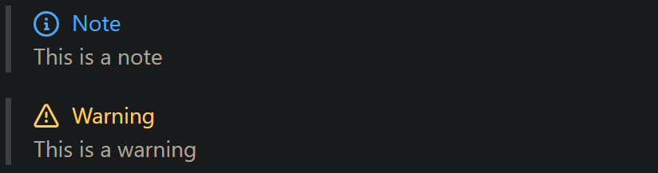
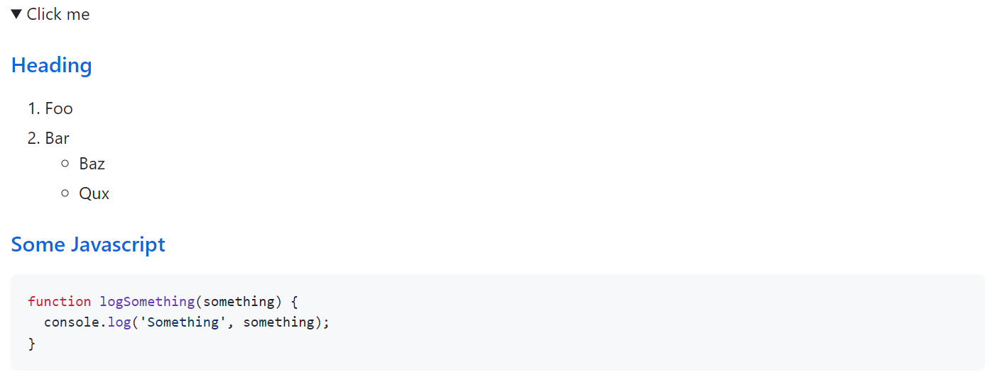

# Git, GitHub, and GitHub CLI (cookbook)

<!-- git-github-gh-cli.md -->
- [Git](#git)
- [Initial Repo Configuration](#initial-repo-configuration)
- [Fundamental Concepts](#fundamental-concepts)
    - [Local branch vs. remote branch](#local-branch-vs-remote-branch)
    - [HEAD, master, and origin](#head-master-and-origin)
    - [Branching](#branching)
    - [Merging](#merging)
    - [Deleting branches](#deleting-branches)
    - [Git flow](#git-flow)
- [Editting commit history](#editting-commit-history)
    - [Permanently removing files from commit history](#permanently-removing-files-from-commit-history)
    - [How to merge a specific commit from another branch?](#how-to-merge-a-specific-commit-from-another-branch)
    - [Making a small edit to the most recent commit](#making-a-small-edit-to-the-most-recent-commit)
    - [Commit part of a file rather than all of its changes](#commit-part-of-a-file-rather-than-all-of-its-changes)
- [Special Topics](#special-topics)
  - [Git Aliases](#git-aliases)
    - [Changing remote after a repo name change](#changing-remote-after-a-repo-name-change)
  - [SSH keys](#ssh-keys)
  - [Large File Storage](#large-file-storage)
  - [When the .gitignore just won't ignore](#when-the-gitignore-just-wont-ignore)
- [Commit SHA Hashes](#commit-sha-hashes)
- [Submodules](#submodules)
- [GitHub (gh)](#github-gh)
- [GitHub CLI (gh) Cheatsheet](#github-cli-gh-cheatsheet)
- [Releases and Tags](#releases-and-tags)
  - [Releasing Projects on GitHub](#releasing-projects-on-github)
- [GitHub Workflows and `act`](#github-workflows-and-act)
- [GitHub Badges](#github-badges)
    - [Colors](#colors)
    - [Template for a Custom Badge](#template-for-a-custom-badge)
- [GitHub Markdown](#github-markdown)
  - [Notes, Tips, and Warnings](#notes-tips-and-warnings)
  - [Collapsible sections in markdown](#collapsible-sections-in-markdown)
    - [Understanding collapsible sections](#understanding-collapsible-sections)
    - [Customizing the clickable `summary` block](#customizing-the-clickable-summary-block)
    - [Expanding details by default](#expanding-details-by-default)
    - [Nesting collapsible sections](#nesting-collapsible-sections)
- [GitHub Events](#github-events)
  - [Pull Request Events](#pull-request-events)
  - [Pull-request checklist](#pull-request-checklist)
- [Cloning without Cloning](#cloning-without-cloning)

!markdown-toc % --bullets="-" --max-depth=2 --no-firsth1 | clip.exe

max depth 1

max depth 2

max depth 3


## Git

### Fundamental Concepts

#### Initial Repo Configuration

```
git config user.name "UserName"
git config user.email gitHubAccount@email.address 
```

#### Local branch vs. remote branch

- **local branch**: a branch only the local user can see. It exists only on your local machine.
  * Ex. Create local branch named "myNewBranch": `git branch myNewBranch`
- **remote branch**: a branch on a remote location (in most cases 'origin'). Local branches can be pushed to 'origin' (a remote branch), where other users can track it.
  * Ex. Push local branch, "myNewBranch", to the remote, "origin" so that a new branch named "myNewBranch" is created on the remote machine ("origin"):\
    `git push -u origin myNewBranch`
- **remote tracking branch**: A local copy of a remote branch. When 'myNewBranch' is pushed to 'origin' using the command above, a remote tracking branch named 'origin/myNewBranch' is created on your local machine.
- **local tracking branch**: a local branch that is tracking another branch.

source(s): [SNce & Brian Webster.stackoverflow.com](https://stackoverflow.com/questions/16408300/what-are-the-differences-between-local-branch-local-tracking-branch-remote-bra)

#### HEAD, master, and origin

I highly recommend the book "Pro Git" by Scott Chacon. Take time and really read it, while exploring an actual git repo as you do.

- **HEAD**: the current commit your repo is on. Most of the time HEAD points to the latest commit in your current branch, but that doesn't have to be the case. HEAD really just means "what is my repo currently pointing at".\
  In the event that the commit HEAD refers to is not the tip of any branch, this is called a "**detached head**".
- **master**: the name of the default branch that git creates for you when first creating a repo. In most cases, "master" means "the main branch". Most shops have everyone pushing to master, and master is considered the definitive view of the repo. But it's also common for release branches to be made off of master for releasing. Your local repo has its own master branch, that almost always follows the master of a remote repo.
- **origin**: the default name that git gives to your main remote repo. Your box has its own repo, and you most likely push out to some remote repo that you and all your coworkers push to. That remote repo is almost always called origin, but it doesn't have to be.
- `HEAD` is an official notion in git. `HEAD` always has a well-defined meaning. `master` and `origin` are common names usually used in git, but they don't have to be.

source: [HEAD, master, and origin. Matt Greer & Jacqueline P. via stackoverflow.com](https://stackoverflow.com/questions/8196544/what-are-the-git-concepts-of-head-master-origin)

#### Branching

Suppose your application is stable. Later, you discover a gigantic bug that was passing silently. You want to write some tests, fix the bug, and eventually have a stable, passing application once again. To do this, you'd create a branch for the fix and push the branch to the remote so that all of the developers on your team can collaborate and make the fix.

Once all of the necessary changes have been made and the application is stable, someone from the team would commit merge the commits from the other branch into master. Since the commit history from the branch will have been saved to master, the new branch could be deleted without loss of information (if you no longer wanted to work on this branch).

* **View all local branches**: `git branch`
* **Switch branches**: `git checkout [branch-name]`
* **Grab a file from a specific branch**: `git checkout [branch_name] [paths]`. Note that if the files are on a remote branch, you'll have to use\
  `git checkout origin/[branch_name] [paths]` instead.

#### Merging

Merge the specified branch's history into the current one. `git merge [branch]`

#### Deleting branches

Delete local branch `git branch -d [branch-name]`

Delete remote branch `git push origin --delete [branch-name]`

------------------------------------------------------------

#### Git flow

When working on a new feature, branch off from the `develop` branch:

```
git checkout -b newFeature develop
```

Merge finished features into the development branch to add them to the upcoming release. Use the "no fast forward" flag, `--no-ff`, to cause the merge to create a new commit object even if the merge could be performed with a fast-forward. This avoids losing information about the historical existence of a feature branch and groups together all commits that together added the feature.

```
git checkout develop
git merge --no-ff newFeature
git branch -d newFeature
git push origin develop
```

------------------------------------------------------------

### Git: Editting commit history 

#### Permanently removing files from commit history

WHy do this? You may have commited a password, some other sensitive information, or a large file that you want to remove from github. If the change is only a few commits back, you can "rebase" changes out of the history. I actually need to do this for a much older set of files and accidentally uploaded a textbook that takes up almost a GB of space.

`git filter-branch --force --index-filter "git rm --cached --ignore-unmatch PathToSensitiveFile" --prune-empty --tag-name-filter cat -- --all`

All you need to change is the `PathToSensitiveFile` item. Once you've used this command for all of the files you'd like to get rid of, update the origin by typing `git push origin --force --all`.

#### How to merge a specific commit from another branch?

Ex.: `git cherry-pick [commit-codename]`

#### Making a small edit to the most recent commit

`git commit --amend`

This allows you to combine staged changes with the previous commit without writing a new commit. It simply edits the previous one in-place.

To amend with an updated commit message: `git commit --amend -m "updated message"`

To amend without changing the commit message: `git commit --amend --no-edit`

#### Commit part of a file rather than all of its changes

git add --patch \[file-name]

Ref: https://stackoverflow.com/a/1085191


----------------------------------------------


### Git: Special Topics

#### Git Aliases

Ref: [Git Basics - Git Alises](https://git-scm.com/book/en/v2/Git-Basics-Git-Aliases)

```bash
git config --global alias.co checkout
git config --global alias.br branch
git config --global alias.ci commit
git config --global alias.st status
git config --global alias.ac '!git add -A && git commit'
```

#### Changing remote after a repo name change

If you change the name of a repository, the fetch/pull commands may stop working. Git will show you an error along the lines of "`error: failed to push some refs to '{repo_url}.git'`". 

To check which URL the remote references to, use `git remote -v`. Then, set a new URL for remote origin:

```bash
git remote set-url origin {new_repo_url}
```

#### Large File Storage

See https://git-lfs.github.com

#### When the .gitignore just won't ignore

```
git rm -rf --cached .
git add .
```

If you already have unstaged changes, you must run the following after editing the ignore patterns.

```
git update-index --skip-worktree <file-list>
```

You can reverse this with:

```git
git update-index --no-skip-worktree <file-list>
```

### SSH keys

An SSH key is an alternative to username/password authorization on GitHub. This will allow you to bypass entering your username and password for future GitHub commands.

SSH keys come in pairs, a public key that gets shared with services like GitHub, and a private key that is stored only on your computer. If the keys match, you're granted access.

The cryptography behind SSH keys ensures that no one can reverse engineer your private key from the public one.

[SSH Keys for GitHub \[article\]](https://jdblischak.github.io/2014-09-18-chicago/novice/git/05-sshkeys.html)

Generating a new SSH key: Follow [Generating a new SSH key and adding it to the ssh-agent \[article\]](https://docs.github.com/en/free-pro-team@latest/github/authenticating-to-github/generating-a-new-ssh-key-and-adding-it-to-the-ssh-agent)


**References:**

* A successful Git branching model. [[web]](https://nvie.com/posts/a-successful-git-branching-model/)

### Commit SHA Hashes 

Secure Hash Algorithm (SHA) in git refers to a cryptographic hash algorithm.
There are variants like SHA-1, SHA-256, etc. In git, "SHA" usually refers specifically to SHA-1 hashes.

- A commit SHA is a 40-character hexadecimal string that uniquely identifies a
  git commit. It is calculated by applying the SHA-1 hash to the commit
  contents. This allows referring to commits by an ID that is based on the
  commit contents.

- "SHA reference" means referring to a commit by its actual SHA hash rather
  than by a symbolic name such as the branch or tag name. This is unambiguous
  since the SHA is unique to that exact commit.

The main differences between the SHA-1 and SHA-256 hash algorithms are:

| Topic | SHA-1 | SHA-256 |
| ----- | ----- | ------- |
| Digest Length | SHA-1 produces a 160-bit (20 byte) hash value. | SHA-256 produces a 256-bit (32 byte) hash value. |
| Security | There are known cryptanalytic attacks against SHA-1. | Considered more secure against brute force collisions and attacks than SHA-1. |
| Speed | SHA-1 is generally faster to compute than SHA-256. The simpler process results in better performance. |  |
| Adoption | SHA-1 is still more widely used and is the default git
  algorithm. | SHA-256 adoption is growing due to the security weaknesses of SHA-1. |

SHA-256 trades some speed for significantly improved cryptographic strength
over the now dated SHA-1 algorithm.

## Submodules

Submodules allow you to embed a git repository as a subdirectory inside another
git repository. They allow using another project while still maintaining
separation between the two projects.

The outer project contains just the [commit SHA](#commit-sha-hashes) of the inner project. This
reference is stored in `.gitmodules`. Cloning the outer project doesn't
automatically clone the submodule's code. You need to initialize and update
submodules expressly.

- `git submodule add`: Command for including submodules.
- `git submodule init`: Clones the submodule contents to the proper location. 
- `git submodule update`: Syncs the submodule to the correct reference commit.

Submodules allow nested git repos with separate histories and pushing. Making
changes in the submodule requires pushing from within the submodule itself.
Committing in the outer project records a new SHA reference to the submodule.
The parent repo controls which submodule commit is used via the SHA reference.

---

# GitHub (gh)

## GitHub CLI (gh) Cheatsheet


Set the editor as vim instead of the default, nano.
```sh
gh config set editor vim 
```

Other examples of [`gh config set`](https://cli.github.com/manual/gh_config_set):
```sh
gh config set git_protocol ssh --host github.com
gh config set prompt disabled
```


```sh
# list commands
gh issue list
gh pr list
```

```sh
# list commands
gh pr status
gh repo view
```

`gh pr create`: Creates a pull-request
`gh pr checks`: 


GH Issues: 
- `gh issue close`: 

```sh
gh issue list
gh issue create --label bug
gh issue view 123 --web
```

## Releases and Tags

A Git tag is similar to a Git reference, but the Git commit that it points to never changes. Git tags are helpful when you want to point to specific releases.

Tag objects (created with `-a`, `-s`, or `-u`) are called "annotated" tags; they contain a creation date, the tagger name and e-mail, a tagging message, and an optional GnuPG signature. Whereas a "lightweight" tag is simply a name for an object (usually a commit object).

```sh
git tag -s v0.0.16 -m "Release description for v0.0.16" 
```

Refs:
- [Managing Tags - GitHub docs](https://docs.github.com/en/desktop/contributing-and-collaborating-using-github-desktop/managing-commits/managing-tags)
- [`git tag` docs](https://git-scm.com/docs/git-tag)

```sh
# set env var in sh script
export GPG_TTY=$(tty)
```

Delete a tag locally:

```bash
git tag -d [tag-name]
```

Delete a tag on origin:

```bash
git push origin --delete [tag-name]
```

### Releasing Projects on GitHub

Releases are deployable software iterations you can package and make available for a wider audience to download and use.

Ref: https://docs.github.com/en/repositories/releasing-projects-on-github

About Releases (Docs): https://docs.github.com/en/repositories/releasing-projects-on-github/about-releases


## GitHub Workflows and `act`


Run and test workflows locally with [nektos/act](https://github.com/nektos/act). Note that it depends on `docker` to run the workflows.

Installation bash script
```sh
curl https://raw.githubusercontent.com/nektos/act/master/install.sh | sudo bash
```

On MacOS:
```sh
brew install act
```

Example commands:

```sh
# Command structure:
act [<event>] [options]
If no event name passed, will default to "on: push"

# Run a specific job:
act -j test

# List the actions for the default event:
act -l

# List the actions for a specific event:
act workflow_dispatch -l

# Run the default (`push`) event:
act

# Run a specific event:
act pull_request

# Run in dry-run mode:
act -n

# Enable verbose-logging (can be used with any of the above commands)
act -v
```

## GitHub Badges

Badges are concise, consistent, legible images for open source projects. They are common in GitHub `README`s and other webpages and support many package registries, distributions, continuous integration services, and social networks. They look like this:

![Python 3.8+] ![Contributions welcome][contributions-badge] [![License: MIT][mit-license-badge]][license] ![PyTorch][torch-badge]

[Python 3.8+]: https://img.shields.io/badge/python-3.7+-blue.svg
[mit-license-badge]: https://img.shields.io/badge/License-MIT-g.svg 
[license]: https://github.com/eskalnes/grid_world_plus/blob/main/LICENSE
[contributions-badge]: https://img.shields.io/badge/contributions-welcome-yellow.svg 
[torch-badge]: https://img.shields.io/badge/PyTorch-%23EE4C2C.svg?&logo=PyTorch&logoColor=white

Badges come from [shields.io](https://shields.io/). Its source code is hosted at [github.com/badges/shields](https://github.com/badges/shields) and serves roughly a billion images each month.

#### Colors 


Color options are available with keywords, 6-symbol hex codes, and 3-symbol hex codes.


#### Template for a Custom Badge

```sh
https://img.shields.io/badge/<leftLabel>-<rightMsg>-<color>
```


  

## GitHub Markdown

### Notes, Tips, and Warnings

```markdown
> [!NOTE]  
> Highlights information that users should take into account, even when skimming.

> [!TIP]
> Optional information to help a user be more successful.

> [!IMPORTANT]  
> Crucial information necessary for users to succeed.

> [!WARNING]  
> Critical content demanding immediate user attention due to potential risks.

> [!CAUTION]
> Negative potential consequences of an action.
```

Becomes:



Ref: https://github.com/orgs/community/discussions/16925

### Collapsible sections in markdown




```markdown
<details>
  <summary>[Display Text]</summary>
  
  ### Markdown Content

</details>
```

<details>
  <summary>[Show SVG text to copy]</summary>

  ```html
  <svg width="64" height="64" viewBox="0 0 64 64" fill="none" xmlns="http://www.w3.org/2000/svg">
  <path d="M6 7V54H61C61.7956 54 62.5587 54.3161 63.1213 54.8787C63.6839 55.4413 64 56.2044 64 57C64 57.7956 63.6839 58.5587 63.1213 59.1213C62.5587 59.6839 61.7956 60 61 60H3C2.20435 60 1.44129 59.6839 0.87868 59.1213C0.31607 58.5587 0 57.7956 0 57L0 7C0 6.20435 0.31607 5.44129 0.87868 4.87868C1.44129 4.31607 2.20435 4 3 4C3.79565 4 4.55871 4.31607 5.12132 4.87868C5.68393 5.44129 6 6.20435 6 7ZM63.12 17.12L42.12 38.12C41.5575 38.6818 40.795 38.9974 40 38.9974C39.205 38.9974 38.4425 38.6818 37.88 38.12L28 28.24L17.12 39.12C16.551 39.6496 15.7987 39.938 15.0215 39.9246C14.2442 39.9112 13.5024 39.597 12.952 39.048C12.403 38.4976 12.0888 37.7558 12.0754 36.9785C12.062 36.2013 12.3504 35.449 12.88 34.88L25.88 21.88C26.4425 21.3182 27.205 21.0026 28 21.0026C28.795 21.0026 29.5575 21.3182 30.12 21.88L40 31.76L58.88 12.88C59.449 12.3504 60.2013 12.062 60.9785 12.0754C61.7558 12.0888 62.4976 12.403 63.048 12.952C63.597 13.5024 63.9112 14.2442 63.9246 15.0215C63.938 15.7987 63.6496 16.551 63.12 17.12Z" />
  </svg>
  ```

</details>


#### Understanding collapsible sections

The `summary` block dictates what will be visible, and the remainder of the
`details` block is the content of the collapsible section. 

NOTE: When including headings within collapsible sections, remember to add a new
line after the `summary` tag. In general, if you're finding that something fails
to render, add a line break after the closing `</summary>` tag.

#### Customizing the clickable `summary` block

Simply add normal HTML modifications to the `summary` block.

```markdown
<details>
  <summary><i>Wow, so fancy</i></summary>
  <b>WOW, SO BOLD</b>
</details>
```

#### Expanding details by default

You can start out the collapsible section by including the `open` attribute
within the `<details>` tag.

```markdown
<details open>
  <summary>Summay block</summary>
  Text open by default!
</details>
```

#### Nesting collapsible sections

```markdown
<details>
<summary>Section A</summary>
<details>
<summary>Section A.B</summary>
<details>
<summary>Section A.B.C</summary>
<details>
<summary>Section A.B.C.D</summary>
  Done!
</details>
</details>
</details>
</details>
```

- Ref: [Gist - How to add a collapsible section in GitHub markdown](https://gist.github.com/pierrejoubert73/902cc94d79424356a8d20be2b382e1ab)

## GitHub Events

### Pull Request Events

[`pull_request` docs](https://docs.github.com/en/developers/webhooks-and-events/webhooks/webhook-events-and-payloads#pull_request)

`synchronize` (GitHubEvent): Triggered when a pull request's head branch is updated. For example, when the head branch is updated from the base branch, when new commits are pushed to the head branch, or when the base branch is changed.

### Pull-request checklist

- [ ] Describe how to test the PR
- [ ] Screenshot the new behavior if applicable
- [ ] Add a description for context on the chosen implementation strategy
- [ ] Refer to related issues/tasks/cards
- [ ] Resolve merge conflicts: Make sure the target branch is merged into the PR branch.

Self-review
- [ ] Add code comments for lines that reviewer might not understand correctly. Consider refactoring the names of variables and functions for clarity. 
- [ ] DRY: Don't repeat yourself
- [ ] KISS: Keep it simple, sweetie
- [ ] YAGNI: You aren't gonna need it. Check that you are not overcomplicating something for the sake of "making it future-proof". Fowler said "Yagni only applies to capabilities built into the software to support a presumptive feature, it does not apply to effort to make the software easier to modify".

## Cloning without Cloning

This can be accomplished with subversion's `svn export`. This command allows
you to download a single folder.

```bash
svn export https://github.com/<Owner>/<Repo>/trunk/<Path to Directory>
```

Installing subversion:
```bash
sudo apt-get update
sudo apt-get install subversion
# on mac
# brew install svn
```

