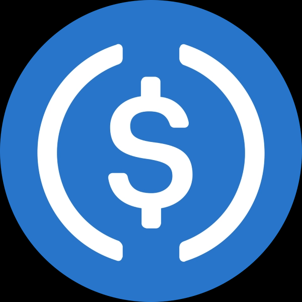

# Cryptocurrency <!-- omit in toc -->

Author: Unique Divine 

### Contents <!-- omit in toc -->
- [TODO](#todo)
- [I. Ethereum](#i-ethereum)
- [II. Cosmos](#ii-cosmos)
    - [Cosmos SDK](#cosmos-sdk)
    - [Osmosis](#osmosis)
    - [Noteworthy Cosmos Projects](#noteworthy-cosmos-projects)
- [Other Blockchain Ecosystems](#other-blockchain-ecosystems)
  - [Terra (LUNA)](#terra-luna)
  - [Binance Smart Chain](#binance-smart-chain)
- [III. Consensus](#iii-consensus)
  - [Proof of Stake](#proof-of-stake)
  - [Tendermint](#tendermint)
- [DeFi Concepts](#defi-concepts)
- [IV. Oracles and Chainlink](#iv-oracles-and-chainlink)
- [Stablecoins](#stablecoins)
- [Else](#else)
  - [Bitcoin and Blockchain Basics](#bitcoin-and-blockchain-basics)
  - [Fiat money vs. Crypto](#fiat-money-vs-crypto)
    - [Tether (USDT)](#tether-usdt)
  - [Miscellaneous Trading Notes](#miscellaneous-trading-notes)
    - [Arbitrage](#arbitrage)
    - [Options](#options)
    - [Tick data](#tick-data)
  - [Distributed Systems](#distributed-systems)
  - [Crypto PHD](#crypto-phd)

---

# TODO   

Tabs open
- https://www.investopedia.com/tech/explaining-crypto-cryptocurrency/
- https://bitcoin.org/en/how-it-works
- https://www.investopedia.com/terms/b/blockchain.asp

Bitcoin
- [ ] Why is blockchain secure? 
- [ ] How does the verification of valid pieces of the blockchain take place?
- [ ] difference b/w bitcoin and etherium blockchain
- [ ] What does it mean to "mine" Bitcoin?
- [ ] What blockchain is Safemoon on?

Bitcoin | Wallets
- How do Crypto wallets work?
- What guarantees the security of a wallet?
- How can the government regulate crypto wallets?
- How do crypto currencies differ from fiat currencies?
- Who owns a burn wallet and how do we know?

<!--  -->
---

# I. Ethereum

[[eth-core]](crypto/eth-core.md)

[[eth-crypto-future-of-money]](crypto/eth-crypto-future-of-money)

[[curve-wars]](crypto/curve-wars.md)

---
<!--  -->

- [Bitcoin](#bitcoin--blockchain)
- [Ethereum](#ethereum)
- [Cosmos](#cosmos)
- [Terra (LUNA)](#terra-luna)

<!--  -->
---

# II. Cosmos 

### Cosmos SDK

- Cosmos SDK: https://v1.cosmos.network/sdk
- Cosmos SDK Documentation: https://docs.cosmos.network/

---
<!--  -->

### Osmosis

[[Osmosis]](crypto/osmosis.md)

---

### Noteworthy Cosmos Projects 

Tharsis: EVM on Cosmos
- Tharsis Twitter [@THarsisHQ](https://twitter.com/TharsisHQ): EVM and blockchain [@EvmosOrg] core developers.
- Website [thars.is](https://t.co/76nlkJl1We?amp=1)
- Why the name Tharis? 
  > Tharsis is a vast  volcanic plateau on Mars that is home to the largest volcanoes in the Solar System.
  > "If the Cosmos Hub is planet Earth, we are looking toward Mars."

Sherlock - @sherlockdefi

<!--  -->
---

# Other Blockchain Ecosystems

## Terra (LUNA)

[Terra Money](crypto/terra.md)

## Binance Smart Chain

[Binance Smart Chain (BSC)](crypto/binance-smart-chain.md)

<!--  -->
---

# III. Consensus

---
<!--  -->

- section link

<!--  -->
---

## Proof of Stake

Limit on block speed is 
- Two mining nodes are creating a block. 

- Archive nodes are run mostly by companies that are block explorers or sourcing historical data.

To have a lite client on Ethereum, we need proof of stake first. 

> Ethereum is account-based. It's a state machine.

Q: Why don't we download the full mainnet history when we run a hardhat node?
- You're only using the current active state of the chain. The node isn't verifying anything or providing security. 

State rent on Solana (topic): Contracts have to pay a little bit to maintain themselves. Unused contracts essentially wither or deprecate.
- [ ] Lookup tradeoffs of state rent.

## Tendermint

References:
- https://docs.tendermint.com/master/introduction/what-is-tendermint.html

---

# DeFi Concepts

[[Vampire-Attacks]](crypto/vampire-attacks)

---

# IV. Oracles and Chainlink

See docs.chain.link (/docs)

Topics to explore
- [ ] Chainlink nodes
- [ ] Chainlink decentralized data feeds: Read data.
- [ ] Any API: https://docs.chain.link/docs/request-and-receive-data/
  - The contact needs LINK in it to pay the node for its work. Any API lets you mesh get requests with contracts directly. 

Importance of decentralized, reliable oracles
- Several large attacks as a result of utilizing a centralized oracle feed

---

# Stablecoins

#### USDT

References: 
- ..

#### USDC

#### DAI

<!--  -->
---

# Else

---
<!--  -->

## Bitcoin and Blockchain Basics

[[Bitcoin-and-Blockchain-Basics]](crypto/bitcoin-and-blockchain-basics.md)

## Fiat money vs. Crypto

---
<!--  -->

Fiat money is legal tender that has its value tied to a government-issued currency like the U.S. dollar. 

Cryptocurrency is a digital asset that derives its value from its native blockchain. 

#### Fiat money 

Fiat money is government-issued currency that is not backed by a physical commodity such as gold or silver but rather by the government that issued it. 

Most modern paper currencies are fiat currencies. This includes the U.S. dollar, the euro, and other major global currencies. 

One danger of fiat money is that, if governements print too much of it, hyperinflation ensues. 

Q: What's the difference b/w fiat money and legal tender?  
: Legal tender is any currency that a government declares to be legal. Fiat money is ...

### Tether (USDT)

Q: What then are coins like USDT?  
- Tether (USDT) is a blockchain-based cryptocurrency whose coins are backed by traditional fiat currencies like the dollar, euro, and yen.
- Tether tokens are native to the Tether network.
- Tether tokens are traded under the USDT symbol.
- USDT stands for 
- Tether (USDT) is a stablecoin, a type of coin which aims to keep crytocurrency valuations stable. 

How does one buy USDT?  
Tether tokens can be transacted on popular exchanges like Binance, CoinSpot, Kraken, etc.

#### Sources 

- [Fiat money - Investopedia](https://www.investopedia.com/terms/f/fiatmoney.asp#:~:text=Fiat%20money%20is%20a%20government,U.S.%20dollar%2C%20are%20fiat%20currencies.)
- O'Connell, B. 2019.  What is Fiat Currency? TheStreet. [[url]](https://www.thestreet.com/how-to/what-is-fiat-currency-14947321)

---

## Miscellaneous Trading Notes

### Arbitrage

Arbitrage occurs when a security is purchased in one market and simultaneously sold in another market, for a higher price.The temporary price difference of the same asset between the two markets lets traders lock in profits.

With foreign exchange investments, the strategy known as arbitrage lets traders lock in gains by simultaneously purchasing and selling an identical security, commodity, or currency, across two different markets. This move lets traders capitalize on the differing prices for the same asset.

- Traders frequently attempt to exploit the arbitrage opportunity by buying a stock on a foreign exchange where the share price hasn't yet been adjusted for the fluctuating exchange rate. 
- An arbitrage trade is considered to be a relatively low-risk exercise.

Beware of Transaction Costs When contemplating arbitrage opportunities, it is essential to take transaction costs into consideration, because if costs are prohibitively high, they may threaten to neutralize the gains from those trades

Ref: https://www.investopedia.com/ask/answers/what-is-arbitrage/

### Options

Glossary: Long, short, put, call, leveraged position, delta neutral

### Tick data

Tick (trading)
: The smallest price increment that a futures contract price can move.

Q: [Futures contract]()?

Futures contract
: A legal agreement to buy or sell a particular commodity, asset, or secuity at a predetermined price at a specified time in the future. Futures contracts are standardized for quality and quantity to facilitate trading on a futures exchange. 
: The buy of a futures contract is taking on the obligation to buy and receive the underlying asset when the futures contract expires, whereas the seller of a futures contract is taking on the obligation to provide and deliver the underlying asset at the expiration time.

Futures contracts are financial derivatives that oblige the buyer to purchase an underlying asset (or the seller to sell that asset) at a predetermined future price and data.

1. Q: I've heard about people trading "futures". What's the different between futures and futures contracts?
   - There is none. "Futures" and "futures contracts" refer to the same thing.  

Q: What is meant by "standardized for quality and quantity" in "futurues contracts are standardized for quality and quantity to facilitate trading on a futures exchange"?  
Q: Why have a futures exchange?

References:
- Investopedia. Futures Contract. 2021. [[link]](https://www.investopedia.com/terms/f/futurescontract.asp)

---

## Distributed Systems

- [A thorough introduction](https://www.freecodecamp.org/news/a-thorough-introduction-to-distributed-systems-3b91562c9b3c/)
- [Distributed systems considerations and tradeoffs](https://www.educative.io/blog/distributed-systems-considerations-tradeoffs)

## Crypto PHD

- Imperial College London
  - Decent advisor: [Arthur Gervais](https://www.google.com/search?q=imperial+college+london+Arthur+Gervais&rlz=1C1VDKB_enUS969US969&oq=imperial+college+london+Arthur+Gervais&aqs=chrome..69i57j0i22i30.9530j0j7&sourceid=chrome&ie=UTF-8)
  - [How to apply](https://www.imperial.ac.uk/study/pg/apply/how-to-apply/apply-for-a-research-programme-/)
  - [Split PhD](https://www.imperial.ac.uk/study/pg/apply/how-to-apply/apply-for-a-research-programme-/)
  - Current student: [Liyi Zhou](https://www.imperial.ac.uk/people/liyi.zhou)
- Edinburgh
  - Program page: [Researchers and PhD students](https://www.ed.ac.uk/informatics/blockchain/people/resarchers-and-phd-students)
  - [Academic staff](https://www.ed.ac.uk/informatics/blockchain/people/academic-staff)
- University College of London (UCL)
  - [PhD program page](https://www.ucl.ac.uk/computer-science/study/postgraduate-research/computer-science-mphilphd)
- Stanford
  - [Stanford Center for Blockchain Research](https://cbr.stanford.edu/research.html)
- University of Stirling
  - [PhD opportunities](https://www.stir.ac.uk/about/faculties/natural-sciences/computing-science-mathematics/phd-opportunities/)
- National University of Singapore (NSU)
  - Advisor: [Haifeng Yu](https://www.comp.nus.edu.sg/~yuhf/)
- EthZurich 
  - [Blockchain initiative page](https://blockchain.ethz.ch/about-us.html)
- University of Texas at Austin
  - [McCombs Finance PhD + Blockchain Research](https://www.mccombs.utexas.edu/Centers/Blockchain/Research)
- [Ranking list from CoinDesk](https://www.coindesk.com/learn/2021/10/04/the-top-universities-for-blockchain-by-coindesk-2021/)

--- 

Zaki's EthDenver talk

Date: 2022-02-18 (金)

Capital markets are not traditionally regulated through enforcement. 

There are elements of the strategy that are
- We should make ourselves hard to regulate
- Approach a more positive form of regulation when it  comes

We're not yet in a world where meaningful conversation is happening. Regulators still don't understand the innovations they're trying to constrain. 

Reducing trust is still key to managing regulatory

One of the things so important about Bitcoin was the way in which BTC could reduce the surface area for trust. Everywhere there is trust, there is a place regulators can intervene. As we move beyond centralized exchanges, we still have to go back to this idea: What relies on trust? 

Implicit software supply chain

Cellars: A platform for running complex DeFi strategies, targeting Ethereum as an initial chain for executing strategies.
- SOMM can be perceived as an alternative to multi-sig.
- Unique approach to trust minimization
- Checks and balances between strategists, validators

Sommelier strategies:
- Borrow/lend 
- Trend-following 
- Stablecoin liquidity

There are validators running the Cosmso blockchain that act as gatekeepers between anyone managing the strategies and the actual execution of trades.

Q: How does somm replace the multi-sig?  
- Smart contracts on Eth are controlled by the Gravity Bridge.  
- The Cosmos chain acts as the multi-sig by verifying people are who they should be.
- If the validator set authenticates the data feed from the strategists, then it's sent for execution.

---

